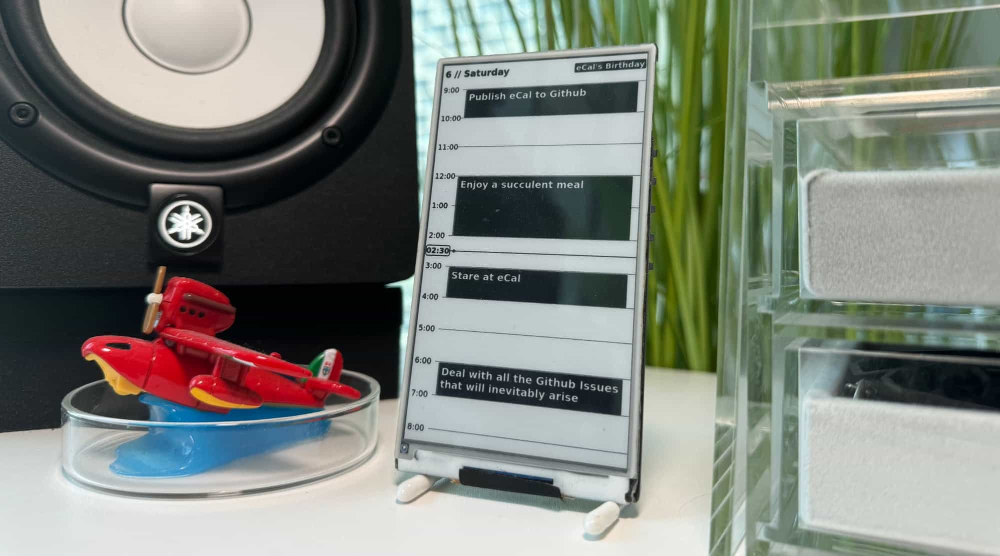

# eCal
Display your Mac iCal calendar events on the timeframe, all locally!



## Prerequisite

Your first step should be to purchase a [LilyGo T5 4.7"
display](https://www.lilygo.cc/en-pl/products/t5-4-7-inch-e-paper)[^1] and setup [The Timeframe](https://gitlab.com/stavros/the-timeframe) on it. 

Make sure everything is working as expected, and you can display an image on it.
To do this you should have a server or something like a raspberry pi setup to generate/host the images to display on the eink screen.

Now on to the fun stuff. To actually have it display your local calendar you should follow the rest of the guide.

### Install

Requirements:
```
- iCalpal
- python3
- Selenium
- Nginx or alternate webserver
- SSH enabled with a working SSH key.
```

#### On your Mac:
1. Install iCalPal

`sudo gem install icalPal`

2. Download the project files

`git clone https://github.com/Porco-Rosso/eCal.git`

3. Configure mac scripts
	1. Place the gen_eCal_data.sh file somewhere on your filesystem such as `~/scripts/eCal/`
	2. Edit the script options according to your setup, namely if you only want it to attempt uploading only when on the right wifi[^2], your server address[^3], and lastly the directory on the server to which the calendar info should be uploaded. It should end up in the eCal-html folder. In my case that is `/root/eCal/eCal-scripts/eCal-html/`. The file will be called `eCal_Output.js`
	3. Make the script executable
	`sudo chmod +x ~/scripts/eCal/gen_eCal_data.sh`
	4. Make sure your SSH key is loaded, so you can upload the file without a password prompt `ssh-add ~/.ssh/[YOUR SSH KEY]`[^4]
	5. Test running the file in the terminal `~/scripts/eCal/gen_eCal_data.sh`
	
	Hopefully everything went well and your `eCal_Output.js` file was uploaded to your server. Feel free to check if the file appeared on your server with ssh or sftp.
	
	6. Now this is a bit of a hack, but the only way I could get permissions to work in order to upload the data in the background through cron, was to make a Mac app for it in automator.
	
		Open Automator.app, choose "Create an Application", add the "Run Shell Script" module, and replace `cat` with your upload script, in our case `/Users/[USER]/scripts/eCal/gen_eCal_data.sh`. 
		
		You can test it using "Run" in the top right corner. If everything is good, save the application somewhere in your filesystem. File>Save.. And save it as an "Application" file format.
		
		Now try launching the application. It should prompt you for some permissions. Accept them all.
		
	7. Finally, we want to run the application at a regular interval, so add it to cron. In terminal run:
	
	`crontab -e`
	
	and add a line pointing to the application such as :
	
	`*/29 * * * * open -g /Users/[USER]/scripts/eCal/gen_eCal.app`[^5]
	
	Congratulations. If you got it all working this far, you should have your calendar information uploading every half hour to your server.
	
#### On your server:
1. Upload the eCal-scripts folder to your server, probably with sftp to somewhere like `~/eCal/`. Make sure the files are in the same relative directories as some values are hard-coded.
2. Edit `eCal-cron.sh` so that the generated image is in the right folder to be served by Nginx.
4. make the script executable `chmod +x eCal-cron.sh`
5. make sure the right dependencies are installed. I belive you need to use `apt install python3 python3-selenium python3-chromedriver` or `pipx install webdriver_manager`. Honestly I can't remember... sorry I am writing this documentation months later.
6. Edit your crontab file on the server with `crontab -e`. You will want to add a line so that the eCal-cron.sh script is run every 30 minutes:

	`*/30 * * * * /root/eCal/eCal-scripts/eCal-cron.sh >/dev/null 2>&1`
	
7. Feel free to run the script manually and verify the appropriate image and hash file are generated and placed in your nginx folder being served. In my case `/var/www/timeframe`. Make sure your timeframe is searching for the image in the right location.


## How it should all run
The Final execution flow should be like this.

1. Every 29 and 59th minute of the hour, gen_eCal will grab your calendar information, and upload it to your server
2. every 30 and 60th minute of the hour, your server will generate an image from the html files, and convert them into the right format for your timeframe to ingest
3. The timeframe wakes up (30 minutes from last power on) and uses wifi to grab the image and displays it. Then it returns to sleep, waiting another 30 minutes.


---
[^1]: It appears that this specific version (v1) is no longer being manufactured.
[^2]: If you are using your laptop at home for instance
[^3]: Best to use something like a raspberry pi with a static address on your LAN.
[^4]: You need to re-run this each time you reboot your system
[^5]: This should run at every 29 and 59 minutes of the hour. Conveniently set if you refresh the display every half hour.